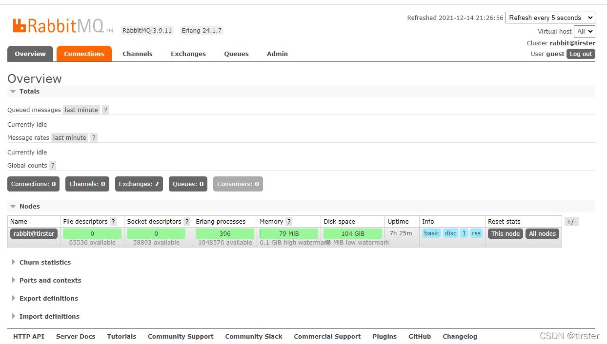

# RabbitMQ
## 下载安装
先安装Erlang再安装RabbitMQ
[版本对应](https://www.rabbitmq.com/which-erlang.html)

### Erlang下载安装
本例使用版本25.3.2

[下载链接](https://erlang.org/download/)

### RabbitMQ下载安装
本例使用版本3.12.1

[下载链接](https://www.rabbitmq.com/install-windows.html)

### 设置
安装完Erlang和RabbitMQ后，打开RabbitMQ Command Prompt (sbin dir)

运行指令:rabbitmq-plugins enable rabbitmq_management

成功显示插件配置后，运行(或者重启服务RabbitMQ)
1. 停止：net stop RabbitMQ
2. 启动：net start RabbitMQ

在浏览器中输入地址查看：http://127.0.0.1:15672/

使用默认账号登录： guest/ guest

登录成功显示以下信息则为安装成功(网图忽略版本号)
