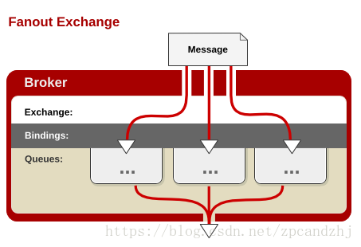
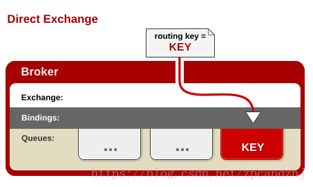
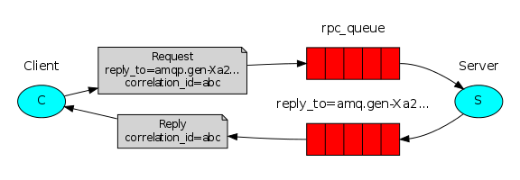

## 模式
Hello World和Work queues生产消息和消费消息方法一样，只不过是Hello World模式只有一个消费者监听消息，Work queues有多个消费者监听消息。

Publish/Subscribe、Routing和Topics生产消息和消费消息方法一样，区别在于Publish/Subscribe(Fanout)的路由是空，Routing(Direct)的路由要严格相等(例：routingKey发送时是ABC.XYZ，接收时也必须是ABC.XYZ)，Topics的路由是匹配模式(例：routingKey发送时是ABC.XYZ, 接收时可以是ABC.*,*.XYZ,ABC.#等)
### 1. Hello World!


### 2. Work queues


### 3. Publish/Subscribe



### 4. Routing



### 5. Topics


### 6. Remote procedure call (RPC)

此模式用得少，在此不做介绍。


## 示例
首先[创建虚拟主机](http://localhost:15672/#/vhosts)demohost
### Maven依赖
pom.xml
```xml
<dependency>
    <groupId>org.springframework.boot</groupId>
    <artifactId>spring-boot-starter-amqp</artifactId>
</dependency>
<dependency>
    <groupId>org.springframework.boot</groupId>
    <artifactId>spring-boot-starter-thymeleaf</artifactId>
</dependency>
<dependency>
    <groupId>org.springframework.boot</groupId>
    <artifactId>spring-boot-starter-web</artifactId>
</dependency>
```
### 配置文件
application.yml
```yml
server:
  port: 6903
  
spring:
  rabbitmq:
    host: localhost
    port: 5672
    username: your_username
    password: your_password
    virtual-host: demohost
#    addresses: 127.0.0.1:5672
    listener:
      simple:
        concurrency: 1
        max-concurrency: 3
        # 消费者预取1条数据到内存，默认为250条 (能者多劳模式，如果需要公平模式，则注释该行)
        prefetch: 1
        # 确定机制(手动确认)
        acknowledge-mode: manual
```

### 代码
RabbitMQ配置类
```java
import org.springframework.amqp.core.Binding;
import org.springframework.amqp.core.BindingBuilder;
import org.springframework.amqp.core.DirectExchange;
import org.springframework.amqp.core.Exchange;
import org.springframework.amqp.core.ExchangeBuilder;
import org.springframework.amqp.core.FanoutExchange;
import org.springframework.amqp.core.Queue;
import org.springframework.beans.factory.annotation.Qualifier;
import org.springframework.context.annotation.Bean;
import org.springframework.context.annotation.Configuration;

@Configuration
public class RabbitmqConfig {
	public final static String QUEUE_NAME_SIMPLE = "q_simple_01";
	public final static String QUEUE_NAME_TASK = "q_task_01";
	public final static String QUEUE_NAME_FANOUT = "q_fanout_01";
	public final static String QUEUE_NAME_DIRECT = "q_direct_01";
	public final static String QUEUE_NAME_TOPIC = "q_topic_01";
	public final static String QUEUE_NAME_TOPIC_OBJECT = "q_topic_object";
	
	public final static String EXCHANGE_NAME_FANOUT = "fanout_logs";	//fanout_logs 
	public final static String EXCHANGE_NAME_DIRECT = "direct_logs";	//direct_logs
	public final static String EXCHANGE_NAME_TOPIC = "topic_logs";
	public final static String EXCHANGE_NAME_TOPIC_OBJECT = "topic_object_logs";

	public final static String ROUTING_KEY_DIRECT = "ABC.OPQ.XYZ";
	public final static String ROUTING_KEY_TOPIC_EMIT = "ABC.XYZ";
	public final static String ROUTING_KEY_TOPIC_RECE = "ABC.*";
	public final static String ROUTING_KEY_TOPIC_OBJECT_EMIT = "OBJECT.XYZ";
	public final static String ROUTING_KEY_TOPIC_OBJECT_RECE = "OBJECT.*";
    
	// ============================== exchange-fanout广播类型交换机 对应官网的Publish/Subscribe begin ==============================
  @Bean("bean_exchange_fanout")
  FanoutExchange fanoutExchange() {
    return new FanoutExchange(EXCHANGE_NAME_FANOUT, true, false);
  }

  @Bean("bean_queue_fanout")
  Queue fanoutQueue() {
    return new Queue(QUEUE_NAME_FANOUT, true);
  }
  
  @Bean
  Binding fanoutBinding(@Qualifier("bean_queue_fanout") Queue queue,
          @Qualifier("bean_exchange_fanout") FanoutExchange exchange) {
      return BindingBuilder
        .bind(queue)
        .to(exchange);
  }
  // ============================== exchange-fanout广播类型交换机 对应官网的Publish/Subscribe end ==============================
  
  // ============================== exchange-direct直连交换机 对应官网的Routing begin ==============================
  @Bean("bean_exchange_direct")
  DirectExchange directExchange() {
    return new DirectExchange(EXCHANGE_NAME_DIRECT, true, false);
  }

  @Bean("bean_queue_direct")
  Queue directQueue() {
    return new Queue(QUEUE_NAME_DIRECT, true);
  }
  
  @Bean
  Binding directBinding(@Qualifier("bean_queue_direct") Queue queue,
        @Qualifier("bean_exchange_direct") DirectExchange exchange) {
    System.out.println("directBinding");
      return BindingBuilder
        .bind(queue)
        .to(exchange)
        .with(ROUTING_KEY_DIRECT);
  }
  // ============================== exchange-direct直连交换机 对应官网的Routing end ==============================
  
  // ============================== exchange-topics主题交换机 对应官网的Topics begin ==============================

  // ------------------------------ topic 字符串 begin ------------------------------
// 声明交换机
  @Bean("bean_exchange_topic")
  Exchange EXCHANGE_NAME_TOPIC(){
    //durable(true) 持久化，mq重启之后交换机还在
    return ExchangeBuilder.topicExchange(EXCHANGE_NAME_TOPIC).durable(true).build();
  }
  
  //声明QUEUE_INFORM_EMAIL队列
  @Bean("bean_queue_topic")
  Queue QUEUE_NAME_TOPIC(){
    return new Queue(QUEUE_NAME_TOPIC);
  }
  
  //ROUTINGKEY_EMAIL队列绑定交换机，指定routingKey
  @Bean
  Binding BINDING_QUEUE_TOPIC(@Qualifier("bean_queue_topic") Queue queue,
      @Qualifier("bean_exchange_topic") Exchange exchange){
    return BindingBuilder.bind(queue).to(exchange).with(ROUTING_KEY_TOPIC_RECE).noargs();
  }
  // ------------------------------ topic 字符串 end ------------------------------
  // ------------------------------ topic 对象 begin ------------------------------
// 声明交换机
  @Bean("bean_exchange_topic_object")
  Exchange EXCHANGE_NAME_TOPIC_OBJECT(){
    //durable(true) 持久化，mq重启之后交换机还在
    return ExchangeBuilder.topicExchange(EXCHANGE_NAME_TOPIC_OBJECT).durable(true).build();
  }
  
  //声明QUEUE_INFORM_EMAIL队列
  @Bean("bean_queue_topic_object")
  Queue QUEUE_NAME_TOPIC_OBJECT(){
    return new Queue(QUEUE_NAME_TOPIC_OBJECT);
  }
  
  //ROUTINGKEY_EMAIL队列绑定交换机，指定routingKey
  @Bean
  Binding BINDING_QUEUE_TOPIC_OBJECT(@Qualifier("bean_queue_topic_object") Queue queue,
      @Qualifier("bean_exchange_topic_object") Exchange exchange){
    return BindingBuilder.bind(queue).to(exchange).with(ROUTING_KEY_TOPIC_OBJECT_RECE).noargs();
  }
  
  // ------------------------------ topic 对象 end ------------------------------
  
  // ============================== exchange-topics主题交换机 对应官网的Topics end ==============================
}
```

生产者类
```java
import org.springframework.amqp.rabbit.core.RabbitTemplate;
import org.springframework.stereotype.Component;

import com.ss.rabbitmq.consumer.model.MessageModel;

import jakarta.annotation.Resource;

@Component
public class RabbitmqProducer {
	
  @Resource
  private RabbitTemplate rabbitTemplate;

  public void send(String queue, String msg) {
    System.out.println("task	生产消息: " + msg);
    this.rabbitTemplate.convertAndSend(queue, msg);
  }

  public void sendFanout(String exchange, String msg) {
    System.out.println("exchange fanout	生产消息: " + msg);
    this.rabbitTemplate.convertAndSend(exchange, "", msg);
  }

  public void send(String exchange, String Routingkey, String msg) {
    System.out.println("exchange	生产消息: " + msg);
    this.rabbitTemplate.convertAndSend(exchange, Routingkey, msg);
  }

  public void emit(String exchange, String Routingkey, MessageModel msg) {
    String str = String.format("exchange[%s - %s]	生产对象消息: %s", exchange, Routingkey, msg);
    System.out.println(str);
    this.rabbitTemplate.convertAndSend(exchange, Routingkey, msg);
  }
}
```

实体类MessageModel
```java
import java.io.Serializable;
import java.util.Date;

public class MessageModel implements Serializable {
	/**
	 * 
	 */
	private static final long serialVersionUID = 8743041311468854329L;

	private String msg;
  private String type;
  private Date date;

	public String getMsg() {
		return msg;
	}
	public void setMsg(String msg) {
		this.msg = msg;
	}
	public String getType() {
		return type;
	}
	public void setType(String type) {
		this.type = type;
	}
	public Date getDate() {
		return date;
	}
	public void setDate(Date date) {
		this.date = date;
	}
	@Override
	public String toString() {
		return "MessageModel [msg=" + msg + ", type=" + type + ", date=" + date + "]";
	}
```

Controller类调用生产者类(topic模式)
```java
import java.util.List;

import org.springframework.beans.factory.annotation.Autowired;
import org.springframework.stereotype.Controller;
import org.springframework.web.bind.annotation.GetMapping;
import org.springframework.web.bind.annotation.PathVariable;
import org.springframework.web.bind.annotation.PostMapping;
import org.springframework.web.bind.annotation.RequestMapping;
import org.springframework.web.bind.annotation.RequestParam;
import org.springframework.web.bind.annotation.ResponseBody;

import com.ss.rabbitmq.consumer.RabbitmqProducer;
import com.ss.rabbitmq.consumer.RabbitmqConfig;
import com.ss.rabbitmq.consumer.model.MessageModel;

@Controller
@RequestMapping("/topic")
public class TopicController {
	
	@Autowired
	RabbitmqProducer rabbitmqProducer;
	
	@GetMapping("/")
	public String index() {
		return "topic";
	}
	
	@PostMapping("/send")
	@ResponseBody
	public String send(@RequestParam String msg, @RequestParam(required = false) String routingKey, @RequestParam(required = false) String exchange) {
		
		try {
			if(routingKey != null && !routingKey.isBlank()) {
				if(exchange != null && !exchange.isBlank()) {
					rabbitmqProducer.send(exchange, routingKey, msg);
				} else {
					rabbitmqProducer.send(RabbitmqConfig.EXCHANGE_NAME_TOPIC, routingKey, msg);
				}
			} else {
				rabbitmqProducer.send(RabbitmqConfig.EXCHANGE_NAME_TOPIC, RabbitmqConfig.ROUTING_KEY_TOPIC_EMIT, msg);
			}
			return "发送成功！";
		} catch (Exception e) {
			e.printStackTrace();
		}
		return "发送失败！";
	}
	
	@PostMapping("/emit")
	@ResponseBody
	public String emit(@RequestParam String msg, @RequestParam String type, @RequestParam(required = false) String routingKey, @RequestParam(required = false) String exchange) {
		
		try {
			// 构造消息
			MessageModel message = new MessageModel();
			message.setMsg(msg);
			message.setType(type);
			
			if(routingKey != null && !routingKey.isBlank()) {
				if(exchange != null && !exchange.isBlank()) {
					rabbitmqProducer.emit(exchange, routingKey, message);
				} else {
					rabbitmqProducer.emit(RabbitmqConfig.EXCHANGE_NAME_TOPIC_OBJECT, routingKey, message);
				}
			} else {
				rabbitmqProducer.emit(RabbitmqConfig.EXCHANGE_NAME_TOPIC_OBJECT, RabbitmqConfig.ROUTING_KEY_TOPIC_EMIT, message);
			}
			return "发送成功！";
		} catch (Exception e) {
			e.printStackTrace();
		}
		return "发送失败！";
	}
}
```

消费者类(topic模式)
```java
import java.io.IOException;

import org.springframework.amqp.core.Message;
import org.springframework.amqp.rabbit.annotation.RabbitListener;
import org.springframework.beans.factory.annotation.Autowired;
import org.springframework.stereotype.Component;

import com.rabbitmq.client.Channel;
import com.ss.rabbitmq.consumer.model.MessageModel;

@Component
public class TopicConsumer {
	@Autowired
	MessageRepository repository;
	
	/**
	 * 接收队列RabbitmqConfig.QUEUE_NAME_TOPIC的字符串消息
	 * @param msg
	 * @param channel
	 * @param message
	 */
	@RabbitListener(queues = RabbitmqConfig.QUEUE_NAME_TOPIC)
    public void receive(String msg, Channel channel, Message message) {
        System.out.println("topic		---------- 收到消息: " + msg);
		try {
			// do something
			
			// 手动确认信息
			channel.basicAck(message.getMessageProperties().getDeliveryTag(), false);
		} catch (IOException e) {
			e.printStackTrace();
			System.err.println("receive err:" + e.getMessage());
			// 确认失败信息
			try {
				channel.basicNack(message.getMessageProperties().getDeliveryTag(), false, true);
			} catch (IOException e1) {
				System.err.println("basicNack err:" + e1.getMessage());
			}
		}
  }
	
	/**
	 * 接收队列RabbitmqConfig.QUEUE_NAME_TOPIC_OBJECT的MessageModel消息
	 * @param msg
	 * @param channel
	 * @param message
	 */
	@RabbitListener(queues = RabbitmqConfig.QUEUE_NAME_TOPIC_OBJECT)
    public void receiveObject(MessageModel msg, Channel channel, Message message) {
        System.out.println("topic		---------- 收到消息: " + msg);
        try {
			// do something
			
			// 手动确认信息
			channel.basicAck(message.getMessageProperties().getDeliveryTag(), false);
		} catch (IOException e) {
			e.printStackTrace();
			System.err.println("receiveObject err:" + e.getMessage());
			// 确认失败信息
			try {
				channel.basicNack(message.getMessageProperties().getDeliveryTag(), false, true);
			} catch (IOException e1) {
				System.err.println("basicNack err:" + e1.getMessage());
			}
		}
  }
}
```

Controller类调用生产者类(工作者模式)
```java
import java.util.List;

import org.springframework.beans.factory.annotation.Autowired;
import org.springframework.stereotype.Controller;
import org.springframework.web.bind.annotation.GetMapping;
import org.springframework.web.bind.annotation.PathVariable;
import org.springframework.web.bind.annotation.PostMapping;
import org.springframework.web.bind.annotation.RequestMapping;
import org.springframework.web.bind.annotation.RequestParam;
import org.springframework.web.bind.annotation.ResponseBody;

import com.ss.rabbitmq.consumer.RabbitmqConfig;
import com.ss.rabbitmq.consumer.RabbitmqProducer;

@Controller
@RequestMapping("/task")
public class TaskController {	
	
	@Autowired
	RabbitmqProducer rabbitmqProducer;
	
	@GetMapping("/")
	public String index() {
		return "task";
	}
	
	@PostMapping("/send")
	@ResponseBody
	public String send(@RequestParam String msg, @RequestParam(required = false) String queue) {
		
		try {
			if(queue != null && !queue.isBlank()) {
				rabbitmqProducer.send(queue, msg);
			} else {
				rabbitmqProducer.send(RabbitmqConfig.QUEUE_NAME_TASK, msg);
			}
			return "发送成功！";
		} catch (Exception e) {
			e.printStackTrace();
		}
		return "发送失败！";
	}
}
```

消费者类(工作者模式)
两个监听receive、receive1代表两个工作者，能者多劳模式下处理消息快的监听者(此例中是receive)将获取更多消息。
```java
import java.io.IOException;

import org.springframework.amqp.core.Message;
import org.springframework.amqp.rabbit.annotation.RabbitListener;
import org.springframework.stereotype.Component;

import com.rabbitmq.client.Channel;

@Component
public class TaskConsumer {
  @RabbitListener(queues = {"work", RabbitmqConfig.QUEUE_NAME_TASK})
  public void receive(String msg, Channel channel, Message message) {
    System.out.println("work1		---------- 收到消息: " + msg);
    try {
			Thread.sleep(3000); // 消息处理的速度不同可以体现能者多劳模式
			// 手动确认信息
			channel.basicAck(message.getMessageProperties().getDeliveryTag(), false);
			
		} catch (InterruptedException | IOException e) {
			e.printStackTrace();
			System.err.println("work1 err:" + e.getMessage());
			// 确认失败信息
			try {
				channel.basicNack(message.getMessageProperties().getDeliveryTag(), false, true);
			} catch (IOException e1) {
				System.err.println("basicNack err:" + e1.getMessage());
			}
		}
  }

  @RabbitListener(queues = {"work", RabbitmqConfig.QUEUE_NAME_TASK})
  public void receive2(String msg, Channel channel, Message message) {
    System.out.println("work2		-------------------- 收到消息: " + msg);
    try {
			Thread.sleep(6000); // 消息处理的速度不同可以体现能者多劳模式
			// 手动确认信息
			channel.basicAck(message.getMessageProperties().getDeliveryTag(), false);
		} catch (InterruptedException | IOException e) {
			e.printStackTrace();
			System.err.println("work2 err:" + e.getMessage());
			// 确认失败信息
			try {
				channel.basicNack(message.getMessageProperties().getDeliveryTag(), false, true);
			} catch (IOException e1) {
				System.err.println("basicNack err:" + e1.getMessage());
			}
		}
  }
}
```

## RabbitMQ错误提示
1. 如果只能获取到一条消息，请检查是否没有手动确认。