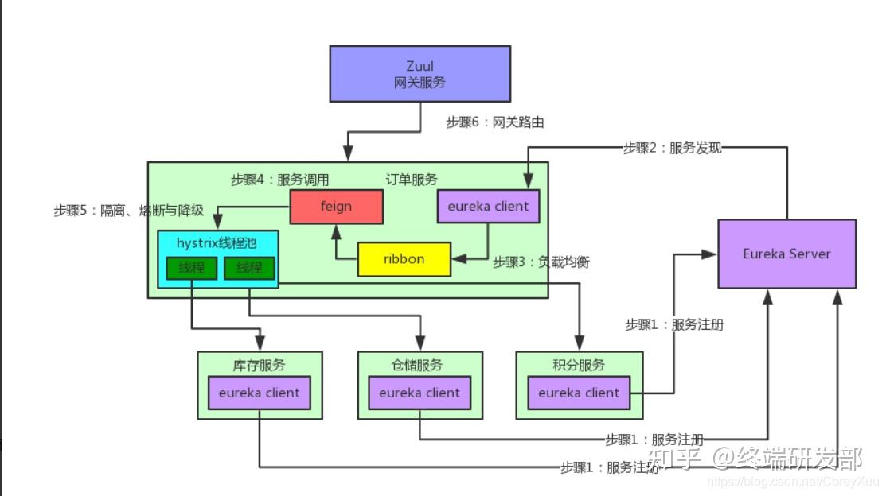

## SpringCloud核心组件:
`Eureka`:服务启动时,Eureka会将服务注册到EurekaService,并且EurakeClient还可以返回过来从EurekaService拉取注册表,从而知道服务在哪里

`Ribbon`:服务间发起请求的时候,基于Ribbon服务做到负载均衡,从一个服务的对台机器中选择一台

`Feign`:基于fegin的动态代理机制,根据注解和选择机器,拼接Url地址,发起请求

`Hystrix`:发起的请求是通过Hystrix的线程池来走,不同的服务走不同的线程池,实现了不同的服务调度隔离,避免服务雪崩的问题

`Zuul`:如果前端后端移动端调用后台系统,统一走zuul网关进入,有zuul网关转发请求给对应的服务

Spring Cloud的5个核心组件通过一张图串联起来

[参考地址](https://zhuanlan.zhihu.com/p/365477753)

# 新版本
2022.0.x

`Netflix Eureka Server` 代替 `Eureka`

`OpenFeign` 代替 `Feign`

`Gateway` 代替 `Zull`

`Spring Cloud Circuit Breaker` 代替 `Hystrix`

`Gateway`和`OpenFeign`都有负载均衡