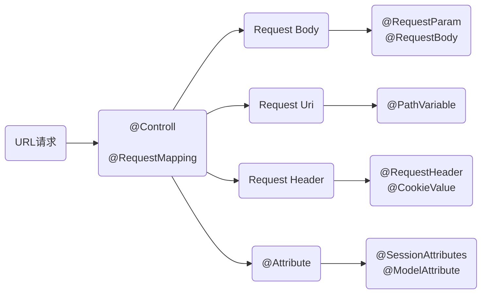

# 组件型注解
以下四种注解都是注解在类上的，被注解的类将被spring初始话为一个bean，然后统一管理。
## @Component
在类定义之前添加@Component注解，他会被spring容器识别，并转为bean。

## @Controller
用于控制层注解 ， (特殊的@Component)

## @Service
用于对业务逻辑层进行注解， (特殊的@Component)

## @Repository
对Dao实现类进行注解 (特殊的@Component)


# 请求和参数型注解
## @RequestMapping
用于处理请求地址映射，可以作用于类和方法上。
- `value`：定义request请求的映射地址

- `method`：定义地request址请求的方式，包括【GET, POST, HEAD, OPTIONS, PUT, PATCH, DELETE, TRACE.】默认接受get请求，如果请求方式和定义的方式不一样则请求无法成功。

- `params`：定义request请求中必须包含的参数值。

- `headers`：定义request请求中必须包含某些指定的请求头，如：RequestMapping(value = "/something", headers = "content-type=text/*")说明请求中必须要包含"text/html", "text/plain"这中类型的Content-type头，才是一个匹配的请求。

- `consumes`：定义请求提交内容的类型。

- `produces`：指定返回的内容类型，仅当request请求头中的(Accept)类型中包含该指定类型才返回

## @RequestParam
用于获取传入参数的值
- `value`：参数的名称

- `required`：定义该传入参数是否必须，默认为true，（和@RequestMapping的params属性有点类似）
```java
@RequestMapping("/requestParams1.do")
public String requestParams1(@RequestParam(required = false) String name){
  System.out.println("name = "+name);
  return "index";
}

@RequestMapping("/requestParams2.do")
public String requestParams2(@RequestParam(value = "name",required = false) String names){
  System.out.println("name = "+names);
  return "index";
}
```
两种请入参方式是一样的，显示声明value的名称时，入参参数名和value一样，没有显示声明的话，像第一种方式声明的，入参参数名和函数参数变量名一样。

## @PathViriable
用于定义路径参数值

- `value`：参数的名称

- `required`：定义传入参数是否为必须值
```java
@RequestMapping("/{myname}/pathVariable2.do")
public String pathVariable2(@PathVariable(value = "myname") String name){
  System.out.println("myname = "+name);
  return "index";
}
```
这个路径声明了{myname}作为路径参数，那么这一段路径将为任意值，@PathVariable将可以根据value获取路径的值。

## @ResponseBody
作用于方法上，可以将整个返回结果以某种格式返回，如json或xml格式。
```java
@RequestMapping("/{myname}/pathVariable2.do")
@ResponseBody
public String pathVariable2(@PathVariable(value = "myname") String name){
  System.out.println("myname = "+name);
  return "index";
}
```
它返回的不是一个页面，而是直接返回字符串"index"

## @CookieValue
用于获取请求的Cookie值
```java
@RequestMapping("/requestParams.do")
public String requestParams(@CookieValue("JSESSIONID") String cookie){
  return "index";
}
```

## @ModelAttribute：
用于把参数保存到model中，可以注解方法或参数，注解在方法上的时候，该方法将在处理器方法执行之前执行，然后把返回的对象存放在 session（前提时要有@SessionAttributes注解） 或模型属性中，@ModelAttribute(“attributeName”) 在标记方法的时候指定，若未指定，则使用返回类型的类名称（首字母小写）作为属性名称。
```java
@ModelAttribute("user")
public UserEntity getUser(){
  UserEntity userEntityr = new UserEntity();
  userEntityr.setUsername("asdf");
  return userEntityr;
}

@RequestMapping("/modelTest.do")
public String getUsers(@ModelAttribute("user") UserEntity user){
  System.out.println(user.getUsername());
  return "/index";
}
```
如上代码中，使用了@ModelAttribute("user")注解，在执行控制器前执行，然后将生成一个名称为user的model数据，在控制器中我们通过注解在参数上的@ModelAttribute获取参数，然后将model应用到控制器中，在jsp页面中我们同样可以使用它。
```html
<body>   ${user.username} </body>
```

## @SessionAttributes
默认情况下Spring MVC将模型中的数据存储到request域中。当一个请求结束后，数据就失效了。如果要跨页面使用。那么需要使用到session。而@SessionAttributes注解就可以使得模型中的数据存储一份到session域中。配合@ModelAttribute("user")使用的时候,会将对应的名称的model值存到session中。
```java
@Controller
@RequestMapping("/test")
@SessionAttributes(value = {"user","test1"})
public class LoginController{
  @ModelAttribute("user")
  public UserEntity getUser(){
    UserEntity userEntityr = new UserEntity();
    userEntityr.setUsername("asdf");
    return userEntityr;
  }

  @RequestMapping("/modelTest.do")
  public String getUsers(@ModelAttribute("user") UserEntity user ,HttpSession session){
    System.out.println(user.getUsername());
    System.out.println(session.getAttribute("user"));
    return "/index";
  }
}
```
结合上一个例子的代码，加了@SessionAttributes注解，然后请求了两次，第一次session中不存在属性名为user的值，第二次请求的时候发现session中又有了，这是因为，这是因为第一次请求时，model数据还未保存到session中请求结束返回的时候才保存，在第二次请求的时候已经可以获取上一次的model了。
```console
# 第一次请求，保存user到session
asdf
null
# 第一次请求，从session读取user
asdf
domain.UserEntity@d000……
```
注意：@ModelAttribute("user") UserEntity user获取注解内容的时候，会先查询session中是否有对应的属性值，没有才去查询Model。