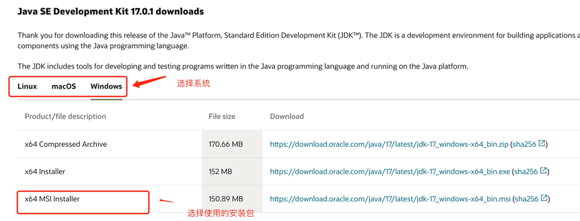

# Java
Java 是由 Sun Microsystems 公司于 1995 年 5 月推出的高级程序设计语言。

Java 可运行于多个平台，如 Windows, Mac OS 及其他多种 UNIX 版本的系统。
## window系统安装java
### 下载JDK
首先我们需要下载 java 开发工具包 JDK，下载地址：https://www.oracle.com/java/technologies/downloads/，在下载页面中根据自己的系统选择对应的版本，以 Window 64位系统为例：

下载后 JDK 的安装根据提示进行，还有安装 JDK 的时候也会安装 JRE，一并安装就可以了。
### 配置环境变量
1. 安装完成后，右击"我的电脑"，点击"属性"，选择"高级系统设置"；
2. 选择"高级"选项卡，点击"环境变量"；
3. 在 "系统变量" 中设置 3 项属性，JAVA_HOME、PATH、CLASSPATH(大小写无所谓),若已存在则点击"编辑"，不存在则点击"新建"。
```
注意：如果使用 1.5 以上版本的 JDK，不用设置 CLASSPATH 环境变量，也可以正常编译和运行 Java 程序。
```
变量设置参数如下：
- 变量名：`JAVA_HOME`
- 变量值：C:\Program Files (x86)\Java\jdk1.8.0_91        // 要根据自己的实际路径配置
- 变量名：`CLASSPATH`
- 变量值：.;%JAVA_HOME%\lib\dt.jar;%JAVA_HOME%\lib\tools.jar;         //记得前面有个"."
- 变量名：`Path`
- 变量值：%JAVA_HOME%\bin;%JAVA_HOME%\jre\bin;

```
注意：在 Windows10 中，Path 变量里是分条显示的，
我们需要将 %JAVA_HOME%\bin;%JAVA_HOME%\jre\bin; 分开添加，否则无法识别：
```
```
%JAVA_HOME%\bin;
%JAVA_HOME%\jre\bin;
```

### 测试JDK是否安装成功
1. "开始"->"运行"，键入"cmd"；
2. 键入命令: java -version、java、javac 几个命令，出现正常的信息说明环境变量配置成功；

## 标题2.2
### 标题2.2.3.1
### 标题2.2.3.2
### 标题2.2.3.3
## 标题2.3
### 标题2.3.3.1
### 标题2.3.3.2