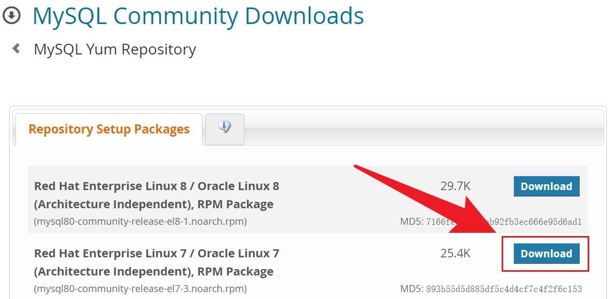

## CentOS-Mysql安装
本机使用方法一成功安装，方法二未验证。
[参考网址](https://zhuanlan.zhihu.com/p/414940867)
### 方法一：通过 YUM 仓库安装
1.  从[官网下载](https://dev.mysql.com/downloads/repo/yum/) YUM 仓库的配置软件包。
以我的为例，是CentOS 7系统。（CentOS 版本是基于Red Hat 版本开发的）


2. 将该软件包上传到 Linux 服务器，并安装。
我的是虚拟机，共享到installer文件夹
```bash
# 进入虚拟机共享文件夹
cd /mnt/hgfs/installer
# 安装
yum install mysql80-community-release-el7-3.noarch.rpm
```

3. 安装 MySQL
```bash
yum install mysql-community-server
```
以上命令除了会安装 mysql-community-server (MySQL server)，还会安装它依赖的其它软件包。

4. 运行 MySQL
```bash
systemctl start mysqld
```
MySQL 在安装完成后不会自动运行。
MySQL 默认会开机自启。

5. 登陆 MySQL
默认超级用户：'root'@'localhost'
密码获取：
```bash
grep 'temporary password' /var/log/mysqld.log
```
登陆方法：
```bash
mysql -uroot -p
```

6. 进入 MySQL 内修改密码
```bash
ALTER USER 'root'@'localhost' IDENTIFIED BY 'MyNewPass4!';
```
将上述命令中的 MyNewPass4! 替换为你的新密码。
注意：密码至少要有一个大写字母，一个小写字母，一个数字，一个特殊符号，并且长度至少为八位。

7. （可选）安装其它组件

MySQL Connectors 在名为 mysql-connectors-community 的软件仓库里，
MySQL Workbench 在名为 mysql-tools-community 的软件仓库里。
这些仓库默认是启用的，可以直接使用 yum 安装。例如安装 MySQL Workbench：
```bash
yum install mysql-workbench-community
```

### 方法二：通过 RPM 软件包安装
该方法是最推荐的安装方法。

1. 下载 RMP 软件包
三种下载方法：
从官方下载网站下载：https://dev.mysql.com/downloads/mysql/
从官方的软件仓库下载：http://repo.mysql.com/yum/mysql-8.0-community/el/7/x86_64/
从镜像站下载：https://mirrors.tuna.tsinghua.edu.cn/mysql/yum/mysql-8.0-community-el7-x86_64/（清华镜像）
RPM bundle 包含所有的文件。如果你只想实现基本的 MySQL 功能，进行最小安装，那需要下载：
mysql-community-server（服务端）
mysql-community-client（客户端）
mysql-community-client-plugins
mysql-community-common（错误消息、字符集等）
mysql-community-libs (客户端库文件)
mysql-community-libs-compat

2. 安装 MySQL
将上述所有的 RPM 包上传到 Linux 服务器，放到同一个文件夹内，进入该文件夹，执行：
```bash
yum install mysql-community-{server,client,common,libs}-*
```
可以使用 rmp -Uvh 代替 yum，但不建议这么做，因为除了刚才下载的那些文件，MySQL 还有很多其它依赖的软件包，使用 rmp -Uvh 很可能导致安装失败。
后面的步骤同方法一。