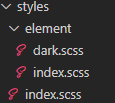

# 黑夜模式

## CSS
### 1.导入CSS
在main.ts(或main.js, 根据项目使用情况)
方法一(简单)
```js
// main.ts
// 如果只想导入css变量
import 'element-plus/theme-chalk/dark/css-vars.css'
```
方法二([element-plus-vite-starter](https://github.com/element-plus/element-plus-vite-starter)例子)
到例子的src文件夹拷贝如下文件(夹)到项目的src文件夹

```js
// main.ts
// 在导入ElementPlus之后
import "./styles/index.scss";
```

### 2.style.css
如果是vite创建的工程,需要注释一些CSS样式

因为vite生成的prefers-color-scheme作用于body层,Element Plus的黑夜模式作用于html层,不注释不能生效

注释src/style.css如下的代码,
```css
:root {
  color-scheme: light dark;
  /* color: rgba(255, 255, 255, 0.87);
  background-color: #242424; */
}

/* @media (prefers-color-scheme: light) {
  :root {
    color: #213547;
    background-color: #ffffff;
  }
  a:hover {
    color: #747bff;
  }
  button {
    background-color: #f9f9f9;
  }
} */
```

## 切换白天黑夜模式
### 1.js
在src文件夹下创建composables/dark.ts,内容如下:
```js
import { useDark, useToggle } from '@vueuse/core'

export const isDark = useDark({
  storageKey: 'el-theme-appearance',
})

export const toggleDark = useToggle(isDark)
```
### 2.vue
在vue文件里添加如下代码
```html
<script setup>
import { isDark, toggleDark } from './composables/dark.ts'
</script>

<template>
  <el-button @click="toggleDark()">
    <span class="ml-2">{{ isDark ? 'Dark' : 'Light' }}</span>
  </el-button>
</template>
```